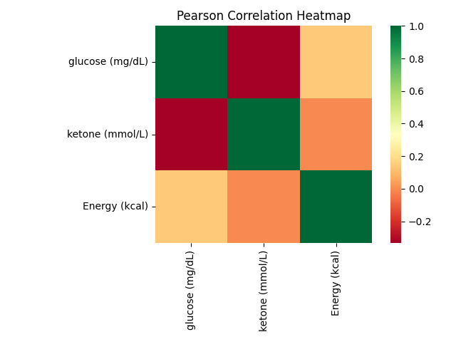
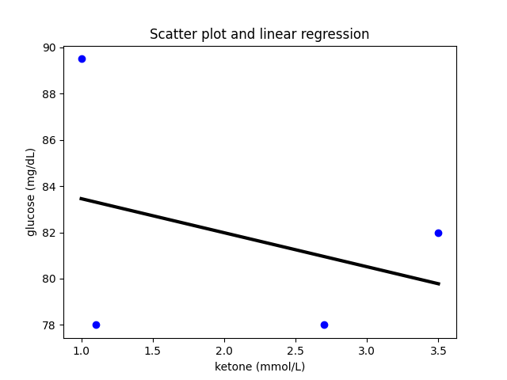
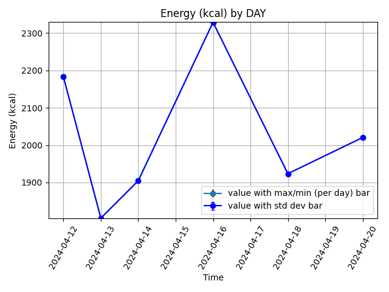
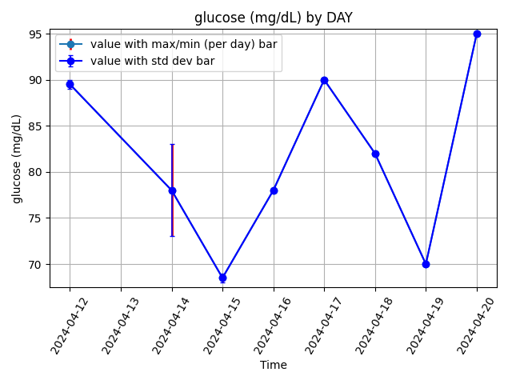

# Chronometer Plotting Classes

This repo contains classes which allow a user to load CSVs from Chronometer and other health tracking-related interfaces, process, and plot this data.

See example script (example.py) for typical usage.

Requires `scikit-learn`, `matplotlib`, `pandas`, and `seaborn`.

## Example output plots

Some examples of output plots:

Heatmap displaying Pearson correlation:

Linear regression with scatter plot:

Energy plotted against day:

Glucose reading plotted against day:

